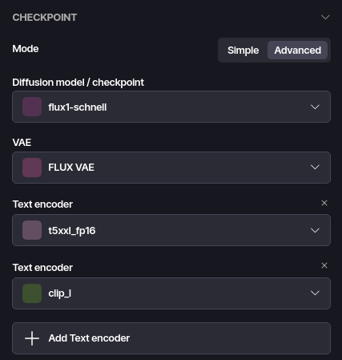

# FLUX

FLUX uses a split checkpoint (i.e. UNET/VAE/CLIP aren't contained in a single file), therefore it can only be used in the "Advanced" checkpoint mode.

## Usage

Following automatic installation, a "metacheckpoint" named "FLUX.1 Schnell" (or similar depending on your choice) will be created. Simply using that option in "Simple" mode is enough.

Following manual installation, models must be selected manually in the "Advanced" checkpoint mode as follows:

## Installation

### Automatic installation

1. Set up a HuggingFace API key as described here: [Downloading gated models from HuggingFace](/guide/usage/model-management.html#huggingface).
2. Go to the "Models" tab.
3. Click on "Recommended".
4. Click on "FLUX.1".
5. Click on the "Download" next to the model you're interested in.
6. After the download completes, a "metacheckpoint" called "FLUX.1 Schnell" (or similar) will be created.

### Manual installation

Due to licensing restrictions, Metastable is unable to provide a fully automatic installation procedure for FLUX. The models can still be installed manually.

1. If you don't have a HuggingFace account yet, create a new account here - https://huggingface.co/join
2. Log into your HuggingFace account.
3. Choose a model and navigate to:

   - FLUX.1 Schnell - https://huggingface.co/black-forest-labs/FLUX.1-schnell
   - FLUX.1 Dev - https://huggingface.co/black-forest-labs/FLUX.1-dev

4. Fill in the "You need to agree to share your contact information to access this model" form, and submit. The access should be granted instantly.
5. Download the following files:

   1. Model file (depending on the model you're trying to use):

      - FLUX.1 Schnell - https://huggingface.co/black-forest-labs/FLUX.1-schnell/resolve/main/flux1-schnell.safetensors
      - FLUX.1 Dev - https://huggingface.co/black-forest-labs/FLUX.1-dev/resolve/main/flux1-dev.safetensors

   2. Text encoders:

      - https://huggingface.co/comfyanonymous/flux_text_encoders/resolve/main/clip_l.safetensors
      - https://huggingface.co/comfyanonymous/flux_text_encoders/resolve/main/t5xxl_fp16.safetensors

   3. VAE: https://huggingface.co/black-forest-labs/FLUX.1-schnell/resolve/main/ae.safetensors

6. Open Metastable.
7. Go to "Settings", "About Metastable" and click on the "Reveal in explorer" button in the "Storage" section.
8. In the newly opened file explorer window, open the "models" directory.
9. Move your model file (sdX_X.safetensors) to the "checkpoint" directory.
10. Move your VAE file (ae.safetensors) to the "vae" directory and rename it to `fluxvae.safetensors`.
11. Move your text encoder files (clip_l.safetensors, t5xxl_fp16.safetensors) to the "text_encoder" directory.

## Supported features

| Feature        | FLUX |
| -------------- | ---- |
| Text-to-image  | ✅   |
| Image-to-image | ✅   |
| Inpainting     | ✅   |
| LORA           | ✅   |
| ControlNet     | ✅   |
| IPAdapter      | ❌   |
| PULID          | ❌   |
